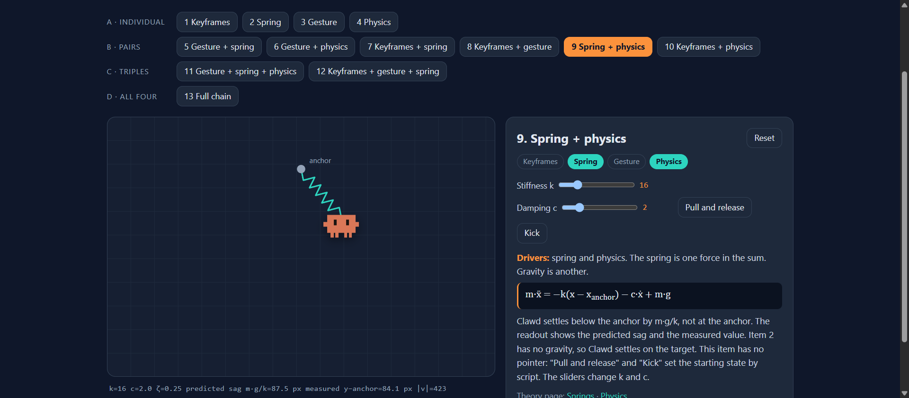
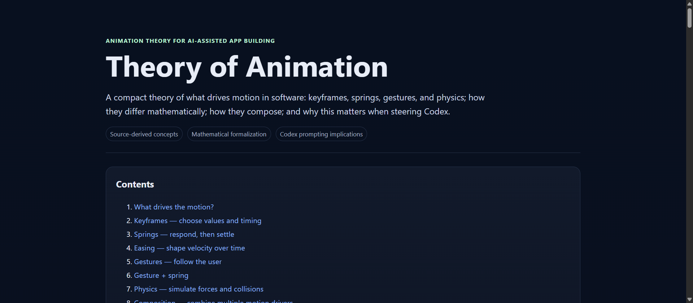

# Theory of Animation

An interactive explainer of what drives motion in software: **keyframes, springs, gestures, and physics**, and how to combine them. It has a written theory page and a demo with 13 animations that you can drag and test.

Both pages are based on John Kim's YouTube video
[How To Use Codex to Create Beautiful App Animations](https://www.youtube.com/watch?v=f-Ar8mwm3kQ).
The animation toolbox and composition ideas come from that video. This repository is an independent study project. It is not affiliated with John Kim.

## Live pages

| Page | What it is | Link |
|---|---|---|
| **Demo** | One draggable character (Clawd) and 13 animations, each with an explainer. | **[Open the live demo](https://az9713.github.io/theory-of-animation/animation_demo.html)** |
| **Theory** | The written theory: what drives motion, the math, composition, and Codex prompting. | **[Open the live theory page](https://az9713.github.io/theory-of-animation/animation_theory.html)** |

GitHub does not run web pages inside a README. The images below are previews. Select an image to open the live page.

## The central question

For every animation, ask: **what controls the next frame?**

| Driver | What controls the next frame | Formal view |
|---|---|---|
| Keyframes | The author, with chosen values and times | x(t) = f(t; θ_author) |
| Spring | A target state plus dynamics (mass, damping, stiffness) | ẍ = f(x, ẋ, x_target) |
| Gesture | The user's pointer or finger | x(t) = f(u(t)) |
| Physics | Forces and constraints | ẍ = f(F, x, ẋ) |

The equations are a formalization added to clarify the video's conceptual framework. The video describes the behavior in words.

## The 13 animations

| Group | # | Animation |
|---|---|---|
| Individual | 1 | Keyframes (with an easing menu) |
| | 2 | Spring (gentle, snappy, bouncy presets) |
| | 3 | Gesture (direct follow and lag follow) |
| | 4 | Physics (gravity, bounce, tilt) |
| Pairs | 5 | Gesture + spring |
| | 6 | Gesture + physics |
| | 7 | Keyframes + spring |
| | 8 | Keyframes + gesture |
| | 9 | Spring + physics |
| | 10 | Keyframes + physics |
| Triples | 11 | Gesture + spring + physics |
| | 12 | Keyframes + gesture + spring (with a "Pause path" button) |
| All four | 13 | Full chain: gesture → spring → physics → keyframes → spring |

Each animation has an explainer panel. It names the driver, shows the equation, and states what is handed from one driver to the next.

You can open one animation directly with a number in the address, for example `animation_demo.html#5`.

## Run it on your computer

There is no build step and there are no packages to install. Download the files, then open `animation_demo.html` or `animation_theory.html` in a web browser.

## Files

- `index.html` redirects the site root, https://az9713.github.io/theory-of-animation/, to the demo.
- `animation_demo.html` is the demo. It uses plain HTML, CSS, and JavaScript, with no libraries.
- `animation_theory.html` is the theory page.
- `assets/` holds the two preview images.

## Notes

- Clawd is the mascot of Claude Code. The pixel art here is an unofficial drawing. It is not affiliated with Anthropic.
- The video transcript is not included in this repository.
